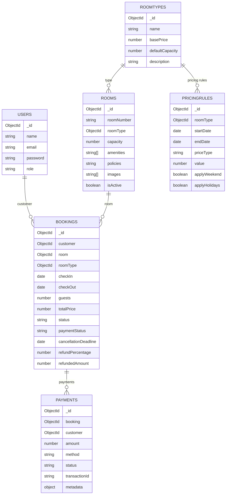

## ERD (MongoDB collections)

Hệ thống dùng MongoDB + Mongoose, các collection chính:

- **`users`**: tài khoản (role: `user | admin | staff`)
- **`roomtypes`**: loại phòng (base price, mô tả, sức chứa mặc định)
- **`rooms`**: phòng cụ thể (roomNumber, roomType, capacity, amenities, policies, images)
- **`pricingrules`**: rule giá theo mùa (gắn với `roomType`, khoảng ngày, cộng fixed/percentage, weekend/holiday)
- **`bookings`**: đặt phòng (customer, room, roomType, checkIn/out, guests, totalPrice, status, paymentStatus, cancellationDeadline, refundPercentage...)
- **`payments`**: giao dịch thanh toán (booking, customer, amount, method: `mock/stripe/paypal/refund`, status: `PENDING/SUCCESS/FAILED`, metadata)

### Quan hệ (mức logical)

- **Room → RoomType**: `rooms.roomType` → `roomtypes._id`
- **Booking → User**: `bookings.customer` → `users._id`
- **Booking → Room**: `bookings.room` → `rooms._id`
- **Booking → RoomType**: `bookings.roomType` → `roomtypes._id`
- **PricingRule → RoomType**: `pricingrules.roomType` → `roomtypes._id`
- **Payment → Booking/User**: `payments.booking` → `bookings._id`, `payments.customer` → `users._id`

### Mermaid ERD (tham khảo)

